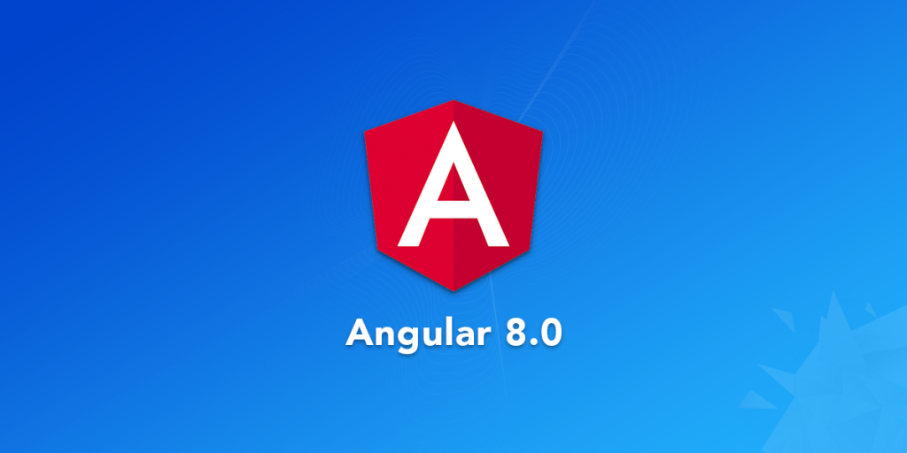

## Desafio de projeto Aprendendo a Criar componentes com Angular 8

##

- [x] Criando um projeto angular 
- [x] Instalando dependências
- [x] Fazendo injeção de dependencias
- [x] Utilizando typescript
- [x] Subindo projeto no heroku

